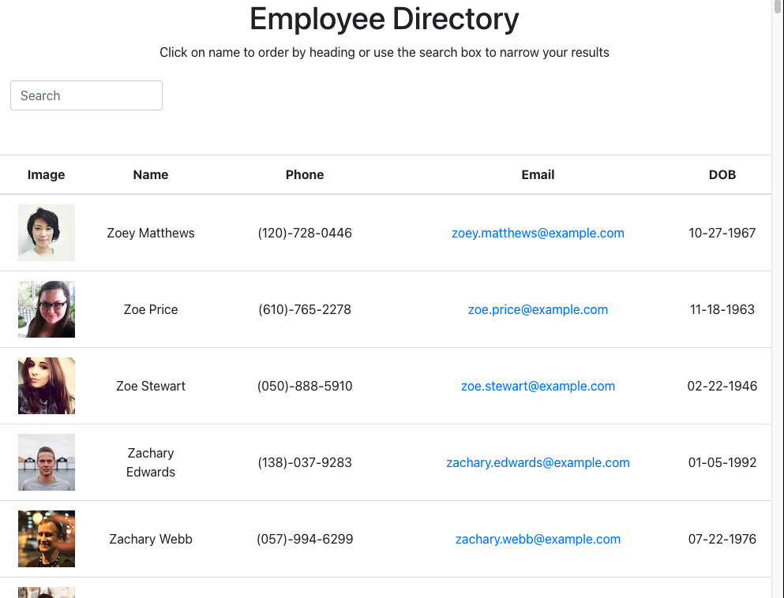
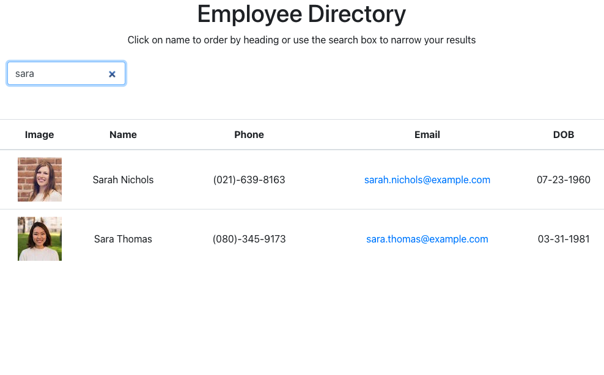

# Employee Directory with React

## Description
This application provides a directory of employee information that can be searched and sorted by name. 
This project was bootstrapped with [Create React App](https://github.com/facebook/create-react-app).

## Available Scripts

In the project directory, you can run:

### `npm start`

Runs the app in the development mode.\
Open [http://localhost:3000](http://localhost:3000) to view it in the browser.

​
## Table of Contents 
​
* [Installation](#installation)
​
* [Usage](#usage)
​
* [License](#license)
​
* [Contributing](#contributing)
​
* [Tests](#tests)
​
* [Questions](#questions)


​
## Installation
​
To install necessary dependencies, run the following command:
​
```
npm i
```
```
npm i axios
```
```
npm i react
```
```
npm i react-dom
```


## Usage
​
use git clone to pull down the repo 

​
## License
​
This project is not licensed.


## Contributing
​
Users cannot contribute to this repo.

​
## Tests
​
To run tests, run the following command:
​
```
npm test
```
​
## Screenshots



### Functional Search



### Deployed App Link
<https://rmmngtn.github.io/EmployeeDirectory/>

## Questions
​
If you have any questions, please contact me directly at <s.pascone@knights.ucf.edu>.
More of my work can be found at [rmmngtn](https://github.com/rmmngtn/).